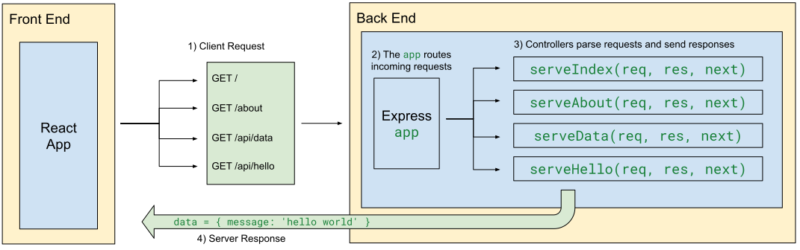

# Intro to Express

- [Terms](#terms)
- [Overview](#overview)
  - [Listening and Routing](#listening-and-routing)
- [Anatomy of a Controller](#anatomy-of-a-controller)
- [Host \& Ports](#host--ports)
- [Challenge](#challenge)

## Terms

* **Server Application** — an application that a client can send requests to over the internet. 
* **Host** and **Port** - the address of a server application
* **Endpoint** — a specific URL path of a server that clients can "hit" (send requests to) to create/read/update/delete data. For example: `'/api/data'` or `/api/users/:id` 
* **Express `app`** — An object that "listens" for requests and "routes" to the appropriate controller.
* **Controller** — a callback function that parses a request and sends a response for a particular endpoint

`nodemon index.js` will re-run the `index.js` file when there is a file change

```
npm i -g nodemon

nodemon index.js
```


## Overview

So how do the client and server interact?

1. Client sends a **request** to the server
1. Server receives the request and **routes** it to the proper **controller**
1. The controller parses the request and sends a **response**
1. The client receives the response and renders the data!
  


**<details><summary style="color: purple">Q: What are the responsibilities of a client?</summary>**

- Rendering HTML, CSS, and JS
- Request information from a server (get requests)
- Providing information to a server (post/patch/delete requests)
- Reading data received from a server

</details><br>

**<details><summary style="color: purple">Q: What are the responsibilities of a server?</summary>**

- Sending HTML, CSS, and JS to a client
- Parsing the information it receives
- Sending data to a client (e.g. weather API)

</details><br>

### Listening and Routing

The main export of Express is the `express` function which creates an object, often named `app` or `server`.

This `app` object is the hub of the server application. It "listens" and "routes" incoming requests to controllers.

```js
const express = require('express');
const app = express();

// controllers
const serveIndex = (req, res, next) => res.sendFile(__dirname + '/index.html');
const serveAbout = (req, res, next) => res.send('<h1>About</h1>');
const serveData = (req, res, next) => res.send([ { name: 'ben' }, { name: 'zo' }]);
const serveHello = (req, res, next) => res.send('hello');

// routes
app.get('/', serveIndex);
app.get('/about', serveAbout);
app.get('/api/hello', serveHello);
app.get('/api/data', serveData);

const port = 8080;
app.listen(port, () => console.log(`listening at http://localhost:${port}`)); 
```

* `8080` is the port which means that when we run this program on our `localhost`, the server is accessible at the URL `http://localhost:8080`. It can really be whatever you want but `8080` is a common choice.
* `app.get(endpoint, controller)` defines which `controller` will be invoked for the specified `endpoint`.  
* A controller is a callback function that parses a request and sends a response. It will be invoked by the `app` when the associated path is hit.

## Anatomy of a Controller

Controllers are callbacks. They are invoked by the `app` and are given three values:
* `req` — an object with data about the request
* `res` — an object with functions for sending a response
* `next` — a function to execute the next controller (we'll learn more about this soon)

```js
const serveIndex = (req, res, next) => res.sendFile(__dirname + '/index.html');
const serveAbout = (req, res, next) => res.send('<h1>About</h1>');
const serveData = (req, res, next) => res.send([ { name: 'ben' }, { name: 'zo' }]);
const serveHello = (req, res, next) => res.send('hello');
```

The first of these to learn about is the `res` object. It has a `send` method that allows us to send data back to the client or `sendFile` to send an HTML file.

> Note: we will use other methods to send files as well

## Host & Ports


Host is like our home address.

* `localhost` is a hostname that refers to the current device used to access it. 
* `localhost` is an alias for `127.0.0.1` which is the standard address used. 
* `localhost === 127.0.0.1`

Ports are the "front doors" of our application. (There are are a lot of doors!)

* `:8080` is considered as a different "door" from `:5500`

Which port should you use? It doesn't really matter, but here are some ones that our instructors like to use and some standards that are used:
* `8080` (What I use)
* `4321` (Mike's favorite because its fun)
* `3000` (What other people use)
* `5500` (What other other people use)
* `80` (Standard unencrypted HTTP port)
* `443` (Standard encrypted HTTPS port)

Just pick one that isn't being used! 

> How do you know which ones aren't being used? Your computer will likely tell you if one is currently in use — just use a different one (or kill the process that is currently using that port).

## Challenge

Setup:
* Create a new repo in GitHub called `first-express-server` and clone it down
* Create a new folder called `server` and `cd` into it
* Run `npm i express`
* Run `npm i -g nodemon`
* Create a `index.js` file
* Run `nodemon index.js` to run your file. Each change you make will cause the file to re-run.

In `index.js`, write a server application using Express that has at least 4 endpoints for GET requests:
* Two of the endpoints should return HTML (try making a file and sending the file!)
* Two of the endpoints should return data (try sending an array of objects!)

It is entirely up to *you* to decide which endpoints your server makes available. However, it is a best practice to:
* start endpoints that provided data with `/api`
* start endpoints that provide HTML with `/`

When you've built your server, visit http://localhost:8080 (or whatever port number you chose) and test out your server!

When you're done, push your code to github and [follow these steps to deploy using Render](https://github.com/The-Marcy-Lab-School/render-deployment-instructions).

[Here is an example of a deployed server!](https://github.com/benspector-mls/first-express-server-f23-test)